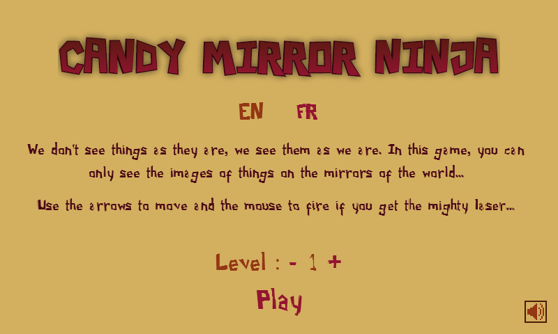
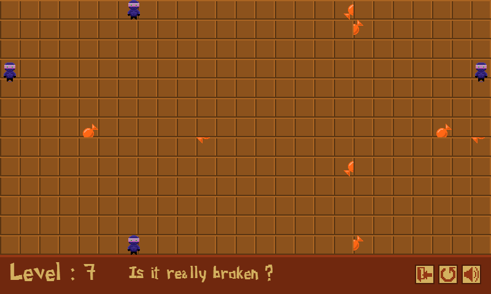
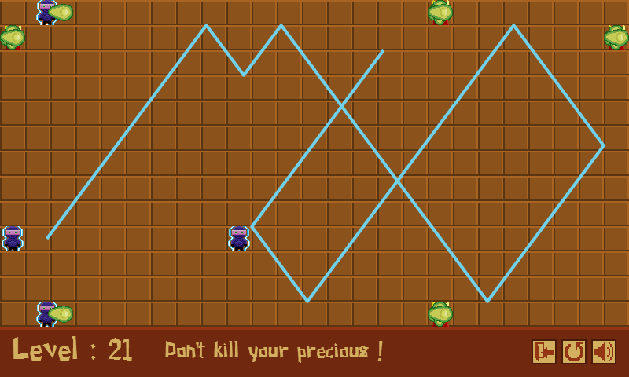

#Candy Mirror Ninja

##Description

Candy Mirror Ninja is a game based on the themes of the Global Game Jam 2014 and the Candy Jam.

It was made with [Phaser](http://phaser.io/) and **needs WebGL** to work.

- You play a Ninja and you have to **collect the Candy** in each level.
- **BUT all the walls in the levels are made of mirrors, you can only see the images of things on the mirrors...**
- Learn to play with this particularity in mind.
- In some levels, the King is present because he wants the Candy for his own. He shoots avocados ("avocado" in French is also the name for "lawyer") that can kill you.
- The closer you get to the Candy, the faster the King shoots.
- In the last levels, you can get a power allowing you to fire a **laser that can reflect on the mirrors** and destroy everything it meets.

##Controls

Controls are simple :

- use the arrows of the keyboard to move the Ninja
- when you get the laser, use the mouse to aim and shoot with the left click

##Special Notes

The game needs WebGL to work. So it doesn't work with Internet Explorer yet. The texts don't render well on Firefox. You need to activate WebGL in Safari. The best browser for it is Google Chrome.

##Screenshots

##Credits

The sounds were made with [Bfxr](http://www.bfxr.net/).

The font is Paper Cuts 2 by [Daniel Wernëck](http://www.dafont.com/fr/profile.php?user=76985).

All other assets were made by me.

##About the game

Candy Mirror Ninja is a *HTML5 game* made by me ([Aurélien Picolet](https://twitter.com/AurelienPicolet)) in May 2014.

You can find it on my portfolio at [http://aurelienpicolet.com/](http://aurelienpicolet.com/) or on itch.io at [http://aurelien974.itch.io/candy-mirror-ninja](http://aurelien974.itch.io/candy-mirror-ninja).

